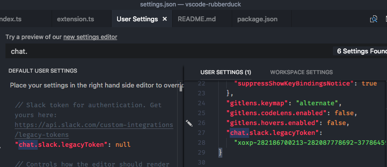
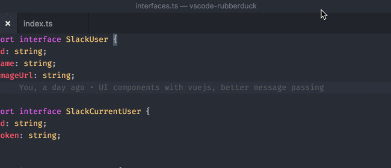
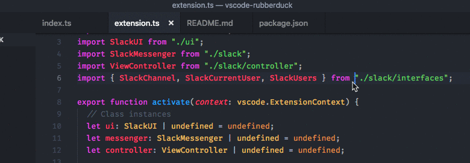
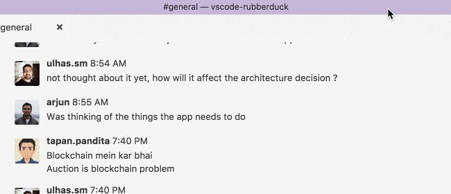

[](https://marketplace.visualstudio.com/items?itemName=karigari.chat)
[](https://travis-ci.org/karigari/vscode-chat)
[](https://join.slack.com/t/karigarihq/shared_invite/enQtMzM5NzQxNjQxNTA1LTM0ZDFhNWQ3YmEyYmExZTY1ODJmM2U3NzExM2E0YmQxODcxYTgwYzczOTVkOGY5ODk2MWE0MzE2ODliNGU1ZDc)

# Slack Chat for VSCode


Send and receive Slack Chat without leaving your editor. Works on channels, private group chats, and direct messages.

## Setup

- Install from the [extensions marketplace](https://marketplace.visualstudio.com/items?itemName=karigari.chat)
- Generate a [Slack legacy token](https://api.slack.com/custom-integrations/legacy-tokens) for your team
- Add token to your settings (File > Preferences > Settings)

```
{
    "chat.slack.legacyToken": "xoxp-2854..."
}
```



## Features

Open the **Command Palette** to use the following features. To open, press:

- On macOS: cmd + shift + P
- On Windows and Linux: ctrl + shift + P

### Open Slack

Open the Command Palette, and select **Slack: Open**. This will create a new panel with your Slack channel.



### Change Slack channel

Open the Command Palette, and select **Slack: Change Channel**. This will change the Slack channel in the open panel.



### Theme colors

Slack Chat for VSCode is compatible with all dark or light themes.



## Contribute

The repo is actively developed, and you are welcome to [submit feature requests](https://github.com/karigari/vscode-chat/issues/new) and pull requests. Broadly, the repo has two parts, that communicate with message passing.

- `src/ui/...` — is the webview UI code, written with Vue.js
- `src/...` — everything else except UI. This is the main extension code, written in TypeScript

## Support

Feel free to [raise an issue](https://github.com/karigari/vscode-chat/issues), or [tweet at us](https://twitter.com/getrubberduck) for any questions or support.

You can also reach me directly at arjun@rubberduck.io

## Credits

The icon for this package is by [icons8](https://icons8.com).
