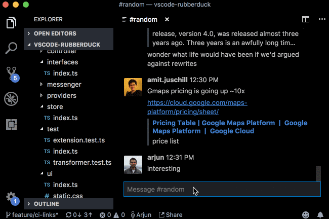
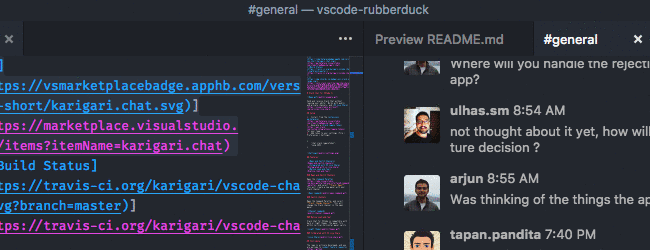
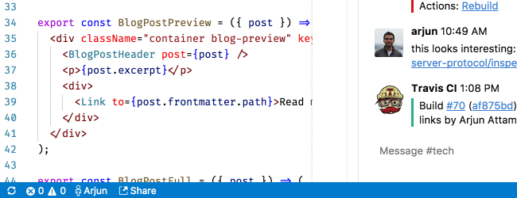

[](https://travis-ci.org/karigari/vscode-chat)
[](https://marketplace.visualstudio.com/items?itemName=karigari.chat)
[](https://marketplace.visualstudio.com/items?itemName=karigari.chat)
[](https://join.slack.com/t/karigarihq/shared_invite/enQtMzM5NzQxNjQxNTA1LTM0ZDFhNWQ3YmEyYmExZTY1ODJmM2U3NzExM2E0YmQxODcxYTgwYzczOTVkOGY5ODk2MWE0MzE2ODliNGU1ZDc)

# Slack Chat for VSCode 💬



## Why though? 🤔

1.  No context switches for [quick code reviews](#rich-formatting)
2.  [Companion chat](#vs-live-share) for VS Live Share
3.  Open [CI logs and other bot integrations](#bots-integration) inside your editor
4.  Why run two Electron apps when you can do with one?

## Setup

1.  Install from the [Visual Studio Marketplace](https://marketplace.visualstudio.com/items?itemName=karigari.chat)
2.  Generate a [Slack legacy token](https://api.slack.com/custom-integrations/legacy-tokens)
3.  Add the token to your settings (File/Code > Preferences > Settings)

```json
{
  "chat.slack.legacyToken": "xoxp-2854..."
}
```

## Commands

Open the [Command Palette](https://code.visualstudio.com/docs/getstarted/userinterface#_command-palette), and select **Slack: Open** or **Slack: Change Channel** to navigate your Slack workspace.



## Rich formatting

Supports Slack's markdown flavour for snippet sharing and feedback, without leaving the context of your editor.


## VS Live Share

Use slash commands start/stop [VS Live Share](https://visualstudio.microsoft.com/services/live-share/) sessions.

- Use `/live share` to initiate a session as host, and send the link to the active channel
- Send `/live end` to end the ongoing session
- Use `/live request` to request someone else to initiate a session


## Bots integration

Code-related bots (CI, version control, etc.) can trigger their actions inside the editor. For example, you can open Travis CI build logs with this configuration. Read more about [Providers](CONTRIBUTING.md#providers).

```json
{
  "chat.providers": ["travis"]
}
```



## Using with network proxy

To use this extension behind a proxy, specify the following configuration.

```json
{
  "chat.proxyUrl": "YOUR_PROXY_URL"
}
```

## Contribute

See [CONTRIBUTING](CONTRIBUTING.md). Our [issues](https://github.com/karigari/vscode-chat/issues) are the best place to look for contribution ideas.

## Support

Feel free to [raise an issue](https://github.com/karigari/vscode-chat/issues), or [tweet at us](https://twitter.com/getrubberduck) for any questions or support. You can also reach me directly at arjun@rubberduck.io

## Credits

The icon for this package is by [icons8](https://icons8.com).
