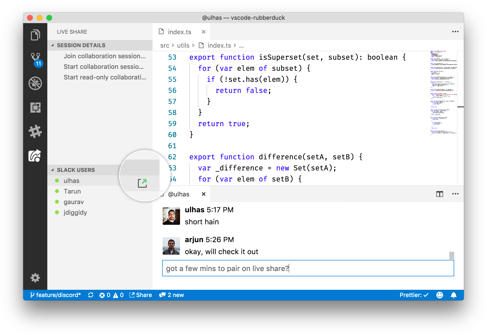

<h1 align="center">Team Chat for VS Code</h1>

<h3 align="center">Collaborate with your team and bots, without context switches. Supports Slack and Discord.</h3>

    
    
    
    

# Setup

1.  Install the extension from the [VS Marketplace](https://marketplace.visualstudio.com/items?itemName=karigari.chat)
2.  **For Slack**, run "Sign In with Slack" from the VS Code command palette
3.  **For Discord**, configure your token with instructions [given here](docs/DISCORD.md)

Are you a Slack workspace admin? [Approve this app](https://slack.com/apps/ACB4LQKN1-slack-chat-for-vs-code) for your team.

# Features

- **Quiet notifications**: status bar item
- **Rich formatting**: code snippets, emojis
- **Native look and feel**: theme, grid layout

    
    
    

# VS Live Share

Online users can be invited for a [VS Live Share](https://aka.ms/vsls) collaboration session. You can also use slash commands `/live share` and `/live end` to start or stop collaboration sessions.

# Support

- **Configuration settings**: To use behind a proxy and other settings, see [CONFIGURATION](docs/CONFIG.md).
- **Raise an issue**: Feel free to [report an issue](https://github.com/karigari/vscode-chat/issues), or find [me on Twitter](https://twitter.com/arjunattam) for any suggestions or support.

# Developer docs

- **Get started with contribution**: See [CONTRIBUTING](docs/CONTRIBUTING.md) to understand repo structure, building and testing.
- **Add new chat providers**: [PROVIDERS](docs/PROVIDERS.md) covers implementation details for any third-party chat provider.
- **Vision**: Read the [VISION](VISION.md) doc to understand the motivation behind this extension and the roadmap ahead.
