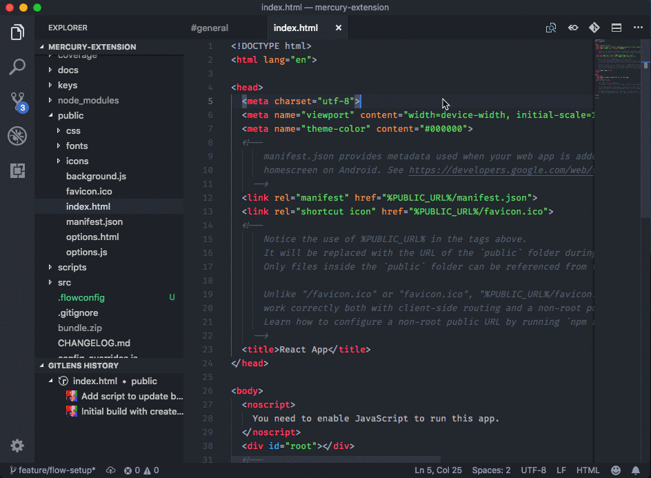

[](https://marketplace.visualstudio.com/items?itemName=karigari.chat)
[](https://join.slack.com/t/karigarihq/shared_invite/enQtMzM5NzQxNjQxNTA1LTM0ZDFhNWQ3YmEyYmExZTY1ODJmM2U3NzExM2E0YmQxODcxYTgwYzczOTVkOGY5ODk2MWE0MzE2ODliNGU1ZDc)

Send and receive Slack chat inside VSCode.



## Setup

- Install from the [extensions marketplace](https://marketplace.visualstudio.com/items?itemName=karigari.chat)
- Generate a [Slack token](https://api.slack.com/custom-integrations/legacy-tokens)
- Add token to your settings (File > Preferences > Settings)

```
{
    "chat.slack.legacyToken": "xoxp-2854..."
}
```

## Features

Open the **Command Palette** to use the following features. To open, press:

- On macOS: cmd + shift + P
- On Windows and Linux: ctrl + shift + P

### Open Slack

Open the Command Palette, and select **Slack: Open**. This will create a new panel with your Slack channel.

### Change Slack channel

Open the Command Palette, and select **Slack: Change Channel**. This will change the Slack channel in the open panel.

## Contribute

vscode-chat is actively developed, and you are welcome to [submit feature requests](https://github.com/karigari/vscode-chat/issues) and pull requests.

## Support

Feel free to [raise an issue](https://github.com/karigari/vscode-chat/issues), or [tweet at us](https://twitter.com/getrubberduck) for any questions or support. You can also reach me directly at arjun@rubberduck.io
